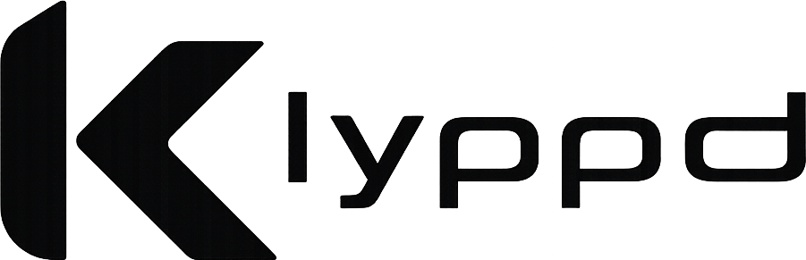

<div align="center">

<picture>
  <source media="(prefers-color-scheme: dark)" srcset="assets/logo-dark.png">
  <source media="(prefers-color-scheme: light)" srcset="assets/logo-light.png">
  
</picture>

**A lightweight, performance-focused clipping and recording app built for speed, customization, and seamless sharing.**

[](#project-status)
[](#requirements)
[](https://git.dec05eba.com/gpu-screen-recorder)
[](LICENSE)

</div>

---

## Preview


---

## Overview

Klyppd is a clipping and screen recording tool that prioritizes **low overhead**, **responsiveness**, and **user control**, all while remaining simple to use.

Unlike many existing clipping tools, Klyppd is designed to stay out of the way: minimal performance impact during gameplay, fast access to your most recent moments, and a workflow that gets clips from capture to shareable link in seconds.

---

## Tech Stack

| Layer | Technology |
|-------|-----------|
| App framework | [Electron](https://www.electronjs.org/) |
| Frontend | [Svelte 5](https://svelte.dev/) + TypeScript |
| Backend | TypeScript (Node.js) |
| Database | [better-sqlite3](https://github.com/WiseLibs/better-sqlite3) |
| Recording | [gpu-screen-recorder](https://git.dec05eba.com/gpu-screen-recorder) |
| Video editing | [FFmpeg](https://github.com/FFmpeg/FFmpeg) |
| Cloud uploads | [Cloudflare R2](https://developers.cloudflare.com/r2/) via AWS S3 SDK |
| Packaging | [electron-builder](https://www.electron.build/) (deb, rpm, AppImage) |

---

## Features

### Fast GPU-Accelerated Recording

Klyppd uses [gpu-screen-recorder](https://git.dec05eba.com/gpu-screen-recorder) as its recording backend, enabling efficient clipping with minimal performance impact.

- Save the **last X seconds** of gameplay or desktop activity
- Fullscreen or window-specific recording
- Instant replay-style clipping
- Standard screen recording support
- Smart filenames generated from the active app (`Sober_2026-05-22.mp4`)

### Built-In Video Trimmer

A built-in trimmer powered by [FFmpeg](https://github.com/FFmpeg/FFmpeg) lets you quickly cut clips without opening an external editor.

- Draggable in/out handles on a scrubbable timeline
- Save trim as a **copy** or **overwrite** the original
- Frame-accurate previews

### Cloud Uploading

Upload clips directly to your own **Cloudflare R2** bucket. Klyppd generates a small HTML embed page alongside the video file with proper OpenGraph and Twitter Card meta tags, so links unfurl into rich Discord / Twitter previews automatically.

- Custom domains
- Temporary or permanent uploads
- Short, branded share links
- Auto-expiring temp clips via R2 lifecycle rules

```txt
https://clip.example.com/t/abc123   # temporary
https://clip.example.com/p/abc123   # permanent
```

> Additional cloud providers are planned for future releases.

### Library Management

- **Search & filter** clips by filename, tags, or folder
- **Sort** by date, name, or duration (ascending/descending)
- Grid and list view modes
- Confirmation dialogs before destructive actions

### Customization

Klyppd is designed to be tweakable. You can configure:

- **Themes** via plain CSS (`~/.config/klyppd/theme.css`) or the in-app theme editor
- **Buffer duration**, FPS, codec, container, audio source
- **Hotkeys** through evdev (works on any compositor) or compositor keybinds
- **Clip save location**

More advanced customization options are planned over time.

---

## How It Works

Klyppd acts as a frontend for `gpu-screen-recorder` while layering on:

- A graphical interface
- Clip management with thumbnails and metadata
- Upload integration
- Trimming tools
- Custom workflows

Hotkey integrations communicate with the running app through a Unix socket (`$XDG_RUNTIME_DIR/klyppd.sock`), so triggers always read live from the app's settings — no shell scripts to keep in sync.

---

## Requirements

### System Dependencies

| Dependency | Purpose |
|-----------|---------|
| `gpu-screen-recorder` | Recording backend |
| `ffmpeg` / `ffprobe` | Video editing, thumbnails, codec detection |
| Node.js ≥ 18 | Build from source |

Klyppd checks for missing dependencies on startup and shows a warning banner if anything is missing.

### Arch Linux

```bash
sudo pacman -S gpu-screen-recorder ffmpeg
```

### Ubuntu / Debian

```bash
sudo apt install gpu-screen-recorder ffmpeg
```

### Fedora

```bash
sudo dnf install gpu-screen-recorder ffmpeg
```

---

## Installation

### AUR (Arch Linux)

```bash
# Recommended — prebuilt binary, installs in seconds
yay -S klyppd-bin

# Or build from latest main (takes a few minutes)
yay -S klyppd-git
```

### From source

```bash
git clone https://github.com/brookerslyn/klyppd
cd klyppd
npm install
npm run electron:build
```

This produces packages in the `release/` directory:
- `.deb` for Debian/Ubuntu
- `.rpm` for Fedora/openSUSE
- `.AppImage` for any Linux distro

#### Install on Debian / Ubuntu

```bash
sudo dpkg -i release/klyppd_*.deb
sudo apt -f install
```

#### Install on Fedora

```bash
sudo dnf install release/klyppd-*.rpm
```

#### Run without installing

```bash
./release/klyppd-*.AppImage
```

### Development

```bash
npm install
npm run electron:dev
```

This starts the Vite dev server and Electron concurrently with hot-reload.

---

## Configuration

Settings live in `~/.config/klyppd/settings.json` and are configured through the Settings tab in-app:

| Setting          | Description                          |
| ---------------- | ------------------------------------ |
| Frame rate       | Recording FPS                        |
| Codec            | h264 / hevc / av1                    |
| Container        | mp4 / mkv / webm                     |
| Audio source     | gpu-screen-recorder audio specifier  |
| Clip directory   | Where clips are saved locally        |
| Buffer duration  | Length of the replay buffer          |

### Cloudflare R2

In **Settings → Cloudflare R2**, fill in:

| Field          | Value                                                   |
| -------------- | ------------------------------------------------------- |
| Endpoint       | `https://<account_id>.r2.cloudflarestorage.com`         |
| Bucket         | your bucket name                                        |
| Access Key     | from R2 → Manage API Tokens                             |
| Secret Key     | from R2 → Manage API Tokens                             |
| Custom Domain  | `https://cdn.yourdomain.com`                            |
| Temp expiry    | matches your bucket's lifecycle rule on the `t/` prefix |

Add a lifecycle rule on the `t/` prefix in your bucket settings to auto-delete temporary clips.

### Hotkeys

Klyppd uses **evdev** (`/dev/input/`) for global hotkeys — they work on **any compositor** (Hyprland, GNOME, KDE, Sway, X11) without any window manager configuration.

#### Setup

Add your user to the `input` group (one-time, requires logout):

```bash
sudo usermod -aG input $USER
```

Then configure hotkeys in **Settings → Hotkeys** inside the app. Any key combo works:

| Action | Default | Examples |
|---|---|---|
| Save replay | `Alt+R` | `F9`, `Super+C`, `Ctrl+Shift+S` |
| Toggle recording | `Alt+Shift+R` | `F10`, `Super+R` |
| Toggle buffer | `Alt+F8` | `F8`, `Super+B` |

Hotkeys work even when a fullscreen game has focus.

#### Fallback: compositor keybinds (optional)

If you prefer not to use the `input` group, you can bind through your compositor instead. These talk to the running app via a Unix socket (`$XDG_RUNTIME_DIR/klyppd.sock`):

```ini
# hyprland.conf
bind = ALT,       R, exec, klyppd --cmd save-replay
bind = ALT SHIFT, R, exec, klyppd --cmd toggle-recording
bind = ALT,      F8, exec, klyppd --cmd toggle-buffer
```

```lua
-- hyprland-lua
hl.bind("ALT + R",         hl.dsp.exec_cmd("klyppd --cmd save-replay"))
hl.bind("ALT + SHIFT + R", hl.dsp.exec_cmd("klyppd --cmd toggle-recording"))
hl.bind("ALT + F8",        hl.dsp.exec_cmd("klyppd --cmd toggle-buffer"))
```

KDE / GNOME / other compositors: use any keybind manager that can run a shell command.

### Theming

Drop a `~/.config/klyppd/theme.css` file to override any of the CSS variables:

```css
:root {
  --bg-deepest: #0b0f12;
  --bg-base: #101418;
  --bg-elev-1: #181c20;
  --bg-elev-2: #1c2024;
  --bg-elev-3: #272a2e;
  --text: #e0e2e8;
  --text-dim: #c2c7cf;
  --text-muted: #8c9198;
  --accent: #9accfa;
  --border: #1c2024;
  --border-strong: #36393e;
}
```

Or use the built-in **Theme Editor** in settings to tweak colors visually and export/import CSS.

---

## Project Status

Klyppd is under **active development**.

The current UI was heavily built with the help of AI-assisted tools to accelerate development as a solo project, so some parts of the interface may still feel experimental or inconsistent. The current focus is **performance, workflow, and functionality first** — UI polish and redesigns will continue over time.

---

## Roadmap

- [ ] Additional cloud providers (S3, MinIO, custom HTTP)
- [ ] Better UI customization
- [x] Improved clip management (tags, folders, filters)
- [x] In-app hotkey configuration
- [ ] Cross-platform support
- [ ] Automatic updates
- [ ] Better onboarding / setup experience
- [x] AUR + AppImage releases

---

## Contributing

Contributions are welcome. Whether you want to:

- Improve the UI
- Add features
- Fix bugs
- Package Klyppd for other distributions
- Improve documentation

…feel free to open a pull request or fork the project.

---

## Support

If Klyppd saved you a few clicks (or a few hundred), you can support the project here:

[](https://ko-fi.com/brookerslyn)
[](https://www.paypal.com/paypalme/brookerslyn)

If you can't donate, **starring the repository** helps a ton too.

---

## License

[MIT](LICENSE)
